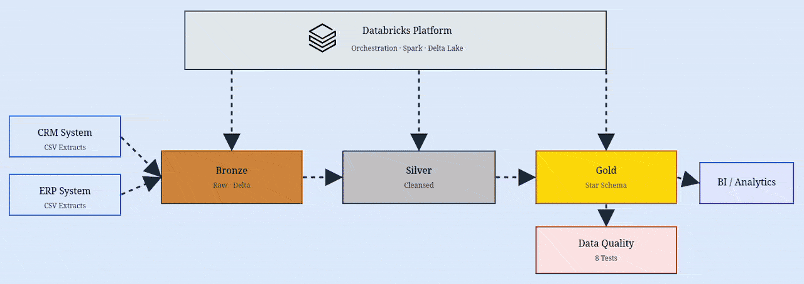
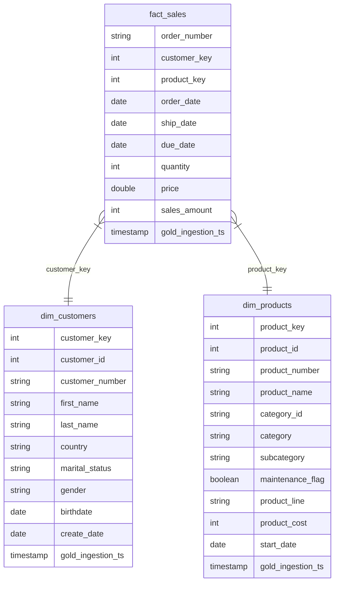

# Medallion Architecture for Retail Data in Databricks

## Overview

This project implements a **Medallion Architecture** on Databricks to transform retail data from CRM and ERP systems into a high-performance Star Schema for analytics.

## Technical Architecture

- **Bronze (Raw)**  
  Ingest CSV files from `datasets/` into Delta tables using Python notebooks.

- **Silver (Cleansed)**  
  Cleanse and standardize data using Python notebooks, applying validation and transformation logic.

- **Gold (Curated)**  
  Build a Star Schema optimized for BI using Python notebooks:
  - **dim_customers & dim_products**: cleaned, unique dimensions with surrogate keys  
  - **fact_sales**: consolidated transactional fact table with referential integrity

- **Shared Components**
  - **helpers/**: Bronze and Silver engines to avoid duplicated logic across notebooks  
  - **tests/**: folder with 8 automated data quality checks validating Gold layer

### Data Platform Architecture

## Engineering Highlights

- **Automated Orchestration**: Managed via `run_all_pipeline.ipynb` using `%run` (Databricks Free Edition limitation).  
- **Data Quality**: Eight tests ensure clean, consistent, and reliable data across all layers. 
- **Idempotency**: Safe to rerun without duplicating data.  
- **Error Handling**: Missing category links mapped to 'Unknown' to prevent data loss.  

## 📈 Data Model (Star Schema)

Visual representation of the Gold Zone:

## How to Run
For detailed, step-by-step instructions please see the:  
➡️ [Setup Guide](./SETUP_GUIDE.md)

